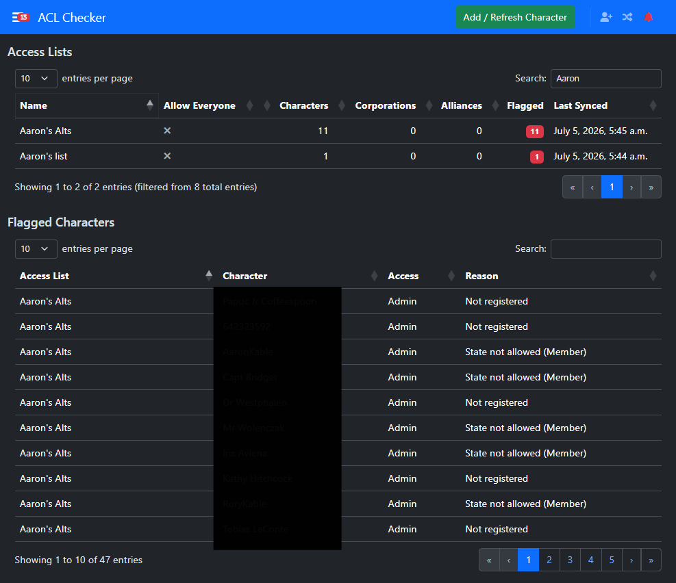

# AA ACL Checker

A plugin app for [Alliance Auth](https://gitlab.com/allianceauth/allianceauth) (AA)
that pulls Access Control Lists (ACLs) from EVE's ESI API, stores them in the
database, and flags characters that appear on an ACL but are not registered in Auth.


> [!IMPORTANT]
>
> **This app needs Alliance Auth v5!**

______________________________________________________________________



## Features

- Periodically syncs ACLs from ESI and stores them in the database.
- Flags characters that are granted access on an ACL but not registered in Auth.
- Has its own menu item in the sidebar showing flagged characters.

## Installing Into Your Dev AA

Make sure you're in your venv, then install it in editable mode:

```bash
pip install -e aa-acl-checker
```

Add `acl_checker` to `INSTALLED_APPS` in `settings/local.py`, then run:

```bash
python manage.py makemigrations
python manage.py check
python manage.py migrate
```

Finally, restart your AA server.

## Installing Into Production AA

```bash
pip install git+https://github.com/aaronkable/aa-acl-checker
```

Then add `acl_checker` to `INSTALLED_APPS` in `settings/local.py`, run migrations and
restart your allianceserver.

## Usage

- **Link a character**: someone with the `add_owner` permission clicks "Add /
  Refresh Character" and authorizes with the `esi-access.read_lists.v1` scope.
  ESI only lets a character list Access Lists it is a Manager or Admin of, so
  the linked character must actually hold one of those roles on the ACLs you
  want tracked. Linking immediately queues a sync and re-authorizes an
  already-linked character if its token has expired or lost the scope.
- **Flagged Characters**: the main page lists every character that ESI
  reports as `Allowed`/`Manager`/`Admin` on a tracked ACL but who has no
  linked, owned character in Auth - i.e. someone with structure/fleet access
  who was never (or is no longer) registered.

## Post-install setup

Linking a character syncs its Access Lists once immediately, but nothing
refreshes them after that unless a periodic task is scheduled. Run this once
after installing/upgrading:

```bash
python manage.py acl_checker_setup
```

This registers an hourly `PeriodicTask` (via `django-celery-beat`) that calls
`acl_checker.tasks.update_all_acls` for every tracked (active) owner
character. It's safe to run again after upgrades - it just updates the
existing schedule rather than duplicating it.

## How syncing works

For each active `Owner` (a character with a valid `esi-access.read_lists.v1`
token):

1. `GET /characters/{character_id}/access-lists` lists the Access Lists that
   character manages or administers.
1. For each one, `GET /characters/{character_id}/access-lists/{access_list_id}`
   fetches its full membership - separate lists of characters, corporations,
   and alliances, each with an access level (`Unspecified`/`Allowed`/`Blocked`/
   `Manager`/`Admin`).
1. The ACL's local membership rows are fully replaced with what ESI just
   returned (ESI's detail response is always a complete snapshot, so a diff
   isn't needed).

ESI never includes a name alongside a character/corporation/alliance ID in
the Access List detail, so none is cached locally - display names are
resolved from Auth's own `EveCharacter` cache at read time instead.

Flagging is computed live, not stored: `AclCharacterEntry.objects.flagged()`
checks whether a granted character_id has an owned `EveCharacter` in Auth.
That means a character clears the flagged list the moment someone registers
it, and a newly-added ACL character shows up as flagged immediately on the
next sync - no separate reconciliation step required.

## Writing Unit Tests

Write your unit tests in `acl_checker/tests/` using the `test_` filename prefix.
